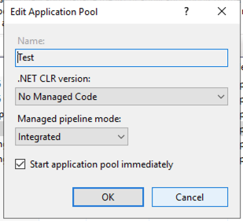

#Project web server static using Golang and Fiber
## Go Command build for Linux

```bash
GOOS=linux GOARCH=amd64 go build main.go
```

##Command build for Windows
```bash
GOOS=windows GOARCH=amd64 go build main.go
```
### Create file web.config
```
<?xml version="1.0" encoding="utf-8"?>
<configuration>
    <system.webServer>
        <handlers>
            <add name="aspNetCore" path="*" verb="*" modules="AspNetCoreModuleV2" resourceType="Unspecified" />
        </handlers>
        <aspNetCore processPath=".\main.exe" />
    </system.webServer>
</configuration>
```

